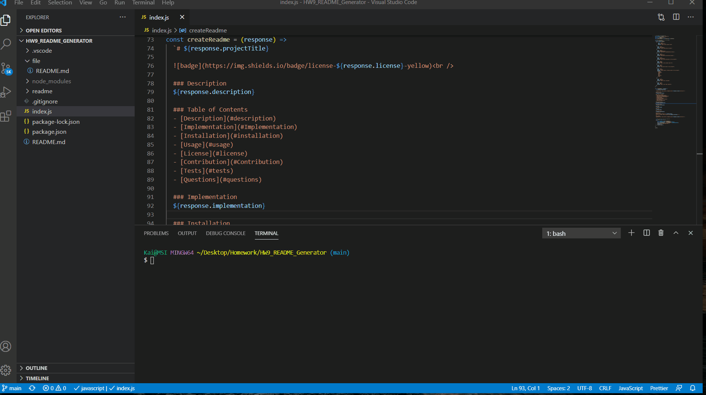

# README Generator

  ### Description
  A node.js app that generate a README file.
  
  ### Table of Contents
  - [Description](#description)
  - [Demo](#Demo)
  - [Implementation](#Implementation)
  - [Installation](#installation)
  - [Usage](#usage)
  - [License](#license)
  - [Contribution](#Contribution)
  - [Tests](#tests)
  - [Questions](#questions)

  ### Demo

  ### Implementation
  Utilized node.js, inquirer and util npm packages.

  ### Installation
  npm install of inquirer and util npm pages are required.

  ### Usage
  U of M Bootcamp homework assignment.

  ### Tests
  No test for this project.

  ### Contribution
  Kai Dong

  ### Questions
  Contact me for questions at dongkai981@gmail.com
  Find me on GitHub: https://github.com/kaidong-chr 

  ### License
   